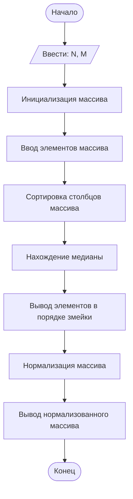

## Отчет по лабораторной работе № 2

#### № группы: `ПМ-2403`

#### Выполнил: `Шурыгина Виктория Андреевна`

#### Вариант: `26`

### Cодержание:

- [Постановка задачи](#1-постановка-задачи)
- [Входные и выходные данные](#2-входные-и-выходные-данные)
- [Выбор структуры данных](#3-выбор-структуры-данных)
- [Алгоритм](#4-алгоритм)
- [Программа](#5-программа)
- [Анализ правильности решения](#6-анализ-правильности-решения)

### 1. Постановка задачи

> Программа получает на вход 2 вещественных числа N и M. Нужно: считать с консоли размеры массива N и M;
> сортировать столбцы массива по возрастанию среднего арифметического значения в столбце;
> найти и вывести медиану всех элементов массива;
> вывести элементы массива в порядке «змейки», начиная с верхнего левого элемента и двигаясь вправо и вниз по диагоналям;
> нормализовать элементы массива и вывести полученный массив.

Данную задачу можно разделить на 2 подзадачи:нахождение медианы всех эллементов массива и вывод элементов массива в порядке змейки.

### 2. Входные и выходные данные

#### Данные на вход

На вход программа должна получать 2 вещественных числа. Нам не даны верхняя и нижняя границы получаемых
чисел, поэтому возьмем за min значение 1,7x10<sup>-308</sup>, а max значение 1,7x10<sup>308</sup>
|             | Тип                | min значение           | max значение         |
|-------------|--------------------|------------------------|----------------------|
| N (Число 1) | Вещественное число | 1,7*10<sup>-308</sup>  | 1,7*10<sup>308</sup> |
| M (Число 2) | Вещественное число | 1,7*10<sup>-308</sup>  | 1,7*10<sup>308</sup> |

#### Данные на выход

Т.к. программа должна вывести медиану всех элементов и вывести элементы массива в порядке "змейки", то на выход мы получим
единственное вещественное неотрицательное число для медианы всех элементов, не превышающее 1,7x10<sup>308</sup> и несколько вещественных чисел для вывода элементов массива в порядке змейки, не превышающее 1,7x10<sup>308</sup> и не меньше 1,7x10<sup>-308</sup>

|                                     | Тип                | min значение         | max значение         |
|-------------------------------------|--------------------|----------------------|----------------------|
| Медиана всех элементов              | Вещественное число |          0           | 1,7*10<sup>308</sup> |
| Элементы массива в порядке "змейки" | Вещественные числа | 1,7*10<sup>-308</sup>| 1,7*10<sup>308</sup>| 

### 3. Выбор структуры данных

Программа получает 2 вещественных числа и элементы массива не превышающих 1,7*10<sup>308</sup>. Поэтому для их хранения
можно выделить 2 переменных (`N` и `M`) типа `double`.

|             | название переменной | Тип (в Java) | 
|-------------|---------------------|--------------|
| N (Число 1) | `N`                 | `double`     |
| M (Число 2) | `M`                 | `double`     | 

### 4. Алгоритм

#### Алгоритм выполнения программы:

1. **Ввод данных:**  
   Программа считывает два вещественных числа, обозначенные как `N` и `M`.

2. **Считывание:**  
   Программа считывает с консоли размеры массива `𝑁` и `𝑀`, затем элементы массива размером `𝑁 × 𝑀`.

3. **Сортировка:**
    Программа сортирует столбцы массива по возрастанию среднего арифметического значения в столбце. Если средние значения равны, сортирует по возрастанию дисперсии элементов в столбце.

4. **Вывод результата:**  
   -	Находит и выводит медиану всех элементов массива.
   -	Выводит элементы массива в порядке «змейки», начиная с верхнего левого элемента и двигаясь вправо и вниз по диагоналям.
   -	Нормализует элементы массива (приводит к диапазону от 0 до 1) и выводит полученный массив.

#### Блок-схема



### 5. Программа

```java
import java.util.Arrays;
import java.util.Scanner;
public class Main {
    public static void main(String[] args) {
        Scanner scanner = new Scanner(System.in);
        System.out.print("Введите размеры массива (N M): ");
        int n = scanner.nextInt();
        int m = scanner.nextInt();
        double[][] array = new double[n][m];
        System.out.println("Введите элементы массива:");
        for (int i = 0; i < n; i++) {
            for (int j = 0; j < m; j++) {
                array[i][j] = scanner.nextDouble();
            }
        }
        // Сортировка столбцов по среднему значению и дисперсии
        Arrays.sort(array, (a, b) -> {
            double avg1 = Arrays.stream(a).average().getAsDouble();
            double avg2 = Arrays.stream(b).average().getAsDouble();
            if (avg1 != avg2) {
                return Double.compare(avg1, avg2);
            } else {
                return Double.compare(variance(a), variance(b));
            }
        });
        // Нахождение медианы всех элементов массива
        double[] allElements = new double[n * m];
        int index = 0;
        for (int i = 0; i < n; i++) {
            for (int j = 0; j < m; j++) {
                allElements[index++] = array[i][j];
            }
        }
        Arrays.sort(allElements);
        double median = allElements[allElements.length / 2];
        // Вывод элементов массива в порядке "змейки"
        for (int i = 0; i < n; i++) {
            if (i % 2 == 0) {
                for (int j = 0; j < m; j++) {
                    System.out.print(array[i][j] + " ");
                }
            } else {
                for (int j = m - 1; j >= 0; j--) {
                    System.out.print(array[i][j] + " ");
                }
            }
        }
        // Нормализация элементов массива и вывод полученного массива
        double min = Arrays.stream(allElements).min().getAsDouble();
        double max = Arrays.stream(allElements).max().getAsDouble();
        for (int i = 0; i < n; i++) {
            for (int j = 0; j < m; j++) {
                array[i][j] = (array[i][j] - min) / (max - min);
                System.out.print(array[i][j] + " ");
            }
        }
        System.out.println("Медиана всех элементов: " + median);
    }
    public static double variance(double[] array) {
        double mean = Arrays.stream(array).average().getAsDouble();
        double sum = 0;
        for (double num : array) {
            sum += Math.pow(num - mean, 2);
        }
        return sum / array.length;
    }
}
```

### 6. Анализ правильности решения

Программа работает корректно на всем множестве решений с учетом ограничений.

1. Тест №1:

    - **Input**:
      Введите размер массива `(N x M)`:
      ```
      3 2
      ```
      Введите элементы массива:
      ```
       1
       2
       3
       4
       5
       3
      ```

    - **Output**:
        ```
        1.0 2.0 4.0 3.0 5.0 3.0 0.0 0.25 0.5 0.75 1.0 0.5 Медиана всех элементов: 3.0
        ```

1. Тест №2:

    - **Input**:
      Введите размер массива `(N x M)`:
      ```
      2 3
      ```
      Введите элементы массива:
      ```
       1
       1
       1
       2
       3
       4
      ```

    - **Output**:
        ```
        1.0 1.0 1.0 4.0 3.0 2.0 0.0 0.0 0.0 0.333 0.666 1 Медиана всех элементов: 2.0
        ```
